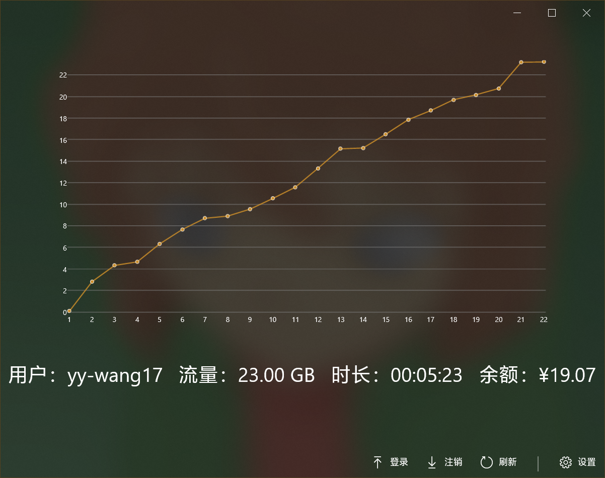
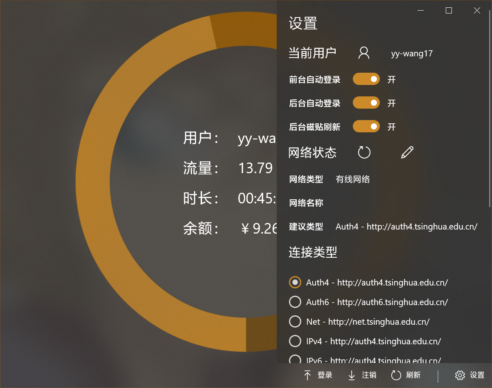
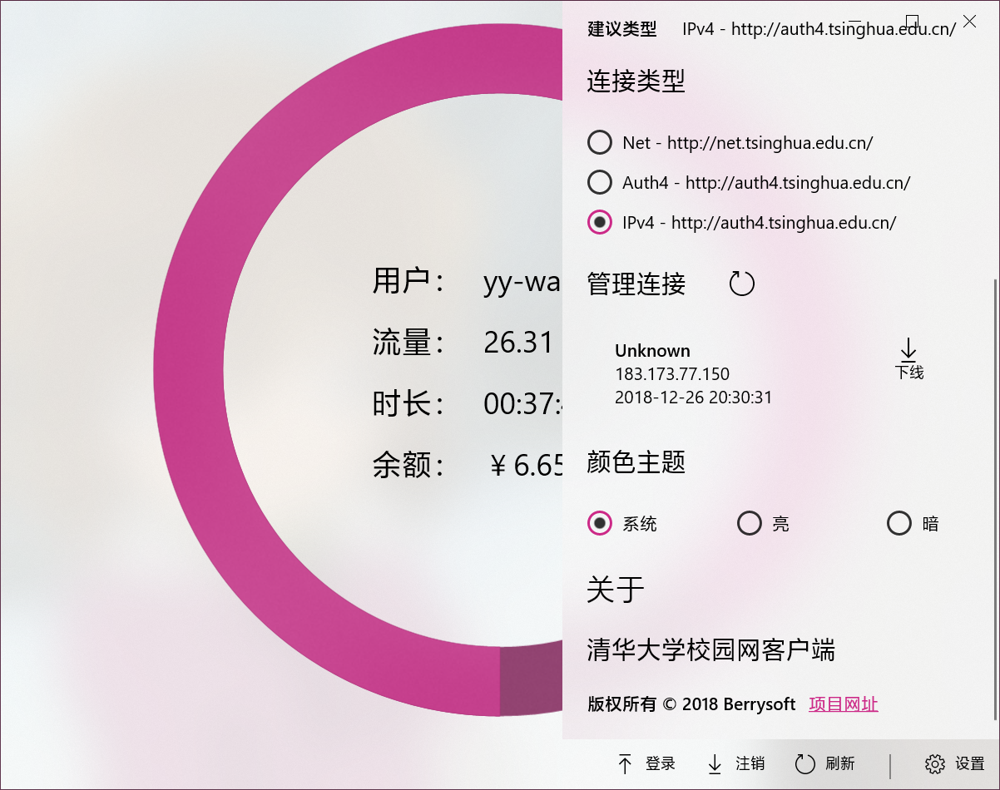
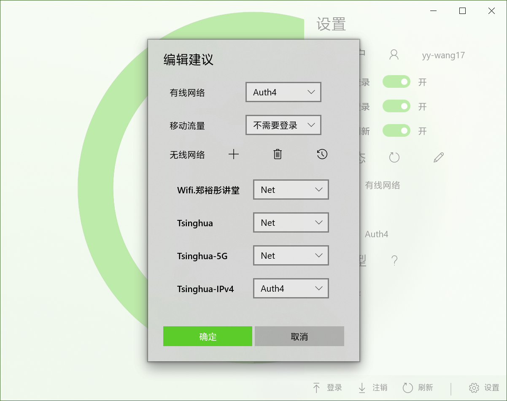
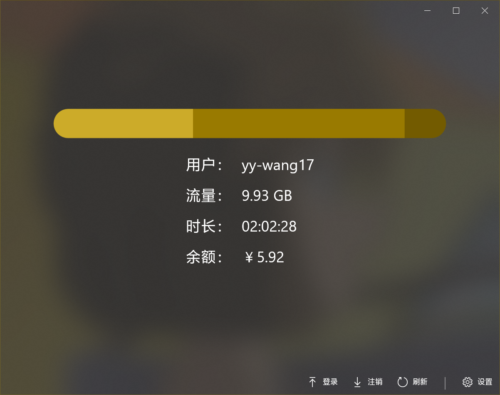
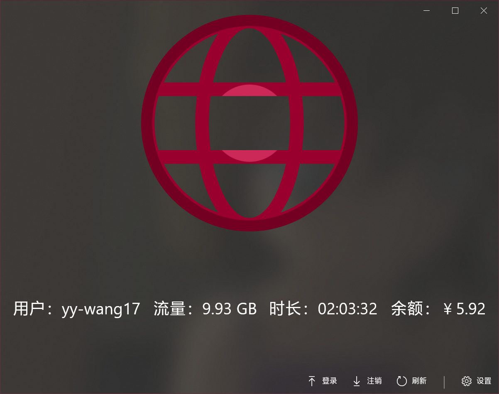
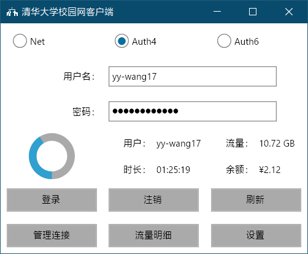
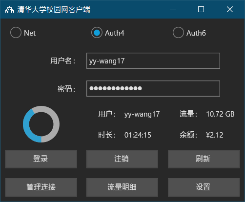

# TsinghuaNet
清华大学校园网联网库与客户端。

## TsinghuaNet
联网库，和一些其他项目需要的辅助类。使用C#，支持 .NET Standard 2.0。

## TsinghuaNet.CLI
命令行版本，使用Visual Basic，支持 .NET Core 3.0，并有针对Windows x64与Linux x64的AOT版本。
### 登录/注销
``` bash
# 使用默认（自动判断）方式登录
TsinghuaNet.CLI login -u 用户名 -p 密码
# 使用默认（自动判断）方式注销，不需要用户名密码
TsinghuaNet.CLI logout
# 使用auth4方式登录
TsinghuaNet.CLI login -s auth4 -u 用户名 -p 密码
# 使用auth4方式注销，需要用户名密码
TsinghuaNet.CLI logout -s auth4 -u 用户名 -p 密码
```
### 在线状态
``` bash
# 使用默认（自动判断）方式
TsinghuaNet.CLI status
# 使用auth4方式
TsinghuaNet.CLI status -s auth4
```
### 查询/强制下线在线IP
``` bash
# 查询
TsinghuaNet.CLI online -u 用户名 -p 密码
# 强制下线
TsinghuaNet.CLI drop -a IP地址 -u 用户名 -p 密码
```
### 流量明细
``` bash
# 使用默认排序（注销时间，升序）查询明细
TsinghuaNet.CLI detail -u 用户名 -p 密码
# 使用登录时间（升序）查询明细
TsinghuaNet.CLI detail -o login -u 用户名 -p 密码
# 使用流量降序查询明细
TsinghuaNet.CLI detail -o flux -d -u 用户名 -p 密码
# 使用流量降序查询明细，并按注销日期组合
TsinghuaNet.CLI detail -o flux -dg -u 用户名 -p 密码
```

## TsinghuaNet.CrossPlatform
Xamarin.Forms版本，使用C#，支持iOS与WPF（测试用），考虑增加Android。

## TsinghuaNet.Eto
Eto.Forms版本，使用Visual Basic，支持 .NET Framework 4.8。支持Windows、Linux与Mac OS桌面平台，平台与实现方式如下表：
|平台|实现|
|-|-|
|Windows|WPF（.NET Framework）|
|Linux|GTK#（Mono）|
|Mac OS|MonoMac（Mono）|

## TsinghuaNet.UWP
UWP版本，3.0以前的版本使用C++/WinRT，之后的版本使用Visual Basic。支持Windows 10.0.16299 (1709)以上版本。

<table>
    <tr>
        <th></th>
        <th></th>
    </tr>
    <tr>
        <th></th>
        <th></th>
    </tr>
    <tr>
        <th></th>
        <th></th>
    </tr>
</table>

## TsinghuaNet.Avalonia（**拟弃用**）

Avalonia版本，使用Visual Basic，支持 .NET Core 3.0，并有针对Windows x64与Linux x64的AOT版本。

<table>
    <tr>
        <th></th>
        <th></th>
    </tr>
</table>

# Q&A
## 为什么需要一个客户端？
为了连接校园网，我们通常需要登录特定的网址，输入用户名和密码，并点击登录。这很麻烦，且由于各种技术原因容易出现误操作。而使用客户端，可以自动完成这些操作，节约时间。
## 这些客户端有什么优势？
* 速度快。
* 针对不同的网络类型给出建议。
* 查看本月流量明细。
* 第一个支持Tsinghua-IPv4无线网。
* 在网络状态改变时会自动判断，后台连接。（UWP独有）
* 后台刷新流量，更新磁贴。（UWP独有）
## 如何确保我的信息安全？
* 用户名和密码使用[Windows凭据管理器](https://support.microsoft.com/zh-cn/help/4026814/windows-accessing-credential-manager)管理。（UWP独有；由于跨平台限制，其余版本尚无法做到完全安全保存密码）
* 其他涉及隐私的信息，如在线用户、上网明细，即时从相应网站获得，不存储。
* 登录时使用了相应的加密算法。
* 所有代码开源，欢迎审核。
## 从哪里下载最新版的程序？
在[Releases](https://github.com/Berrysoft/TsinghuaNet/releases)页面。
## 我该如何从源代码编译这个程序？
为Visual Studio安装“.NET Core 桌面开发”，并需要 .NET Core SDK 3.0与 .NET Framework SDK 4.8。

编译Avalonia还需要安装“.NET Core 跨平台开发”。

编译UWP还需要安装“通用 Windows 平台开发”，并需要Windows SDK 10.0.18362。
## 我可以使用这里的源代码吗？
可以。这个项目使用[MIT许可证](./LICENSE)开源。
## 为什么无法登录Tsinghua-IPv6无线网？
这个技术问题还没有完全解决，欢迎你的帮助。
## 这个程序能卸载干净吗？
卸载时，除了凭据，所有个人配置都会被删除。凭据仅在选中“保存密码”时保存。（UWP独有）

Eto版本的配置文件保存在用户文件夹下的`.config/TsinghuaNet.Eto/settings.json`。

其他版本不需要安装，无所谓卸载。
## 后台任务会不会拖慢系统速度？（UWP独有）
不会。
## 这个程序的颜色在我的电脑上和你的电脑上不同！（UWP独有）
因为用的是主题色。
## 我对这个程序有一些问题/建议……
欢迎[Issues](https://github.com/Berrysoft/TsinghuaNet/issues)和[Pull requests](https://github.com/Berrysoft/TsinghuaNet/pulls)。
## 大佬太厉害了！
反弹！您才是大佬！
