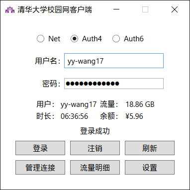
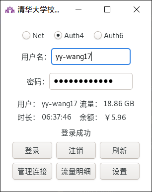
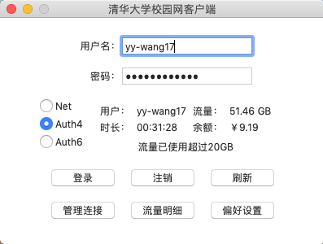
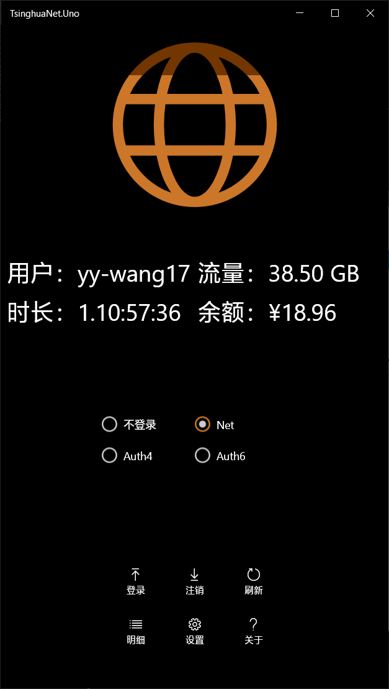
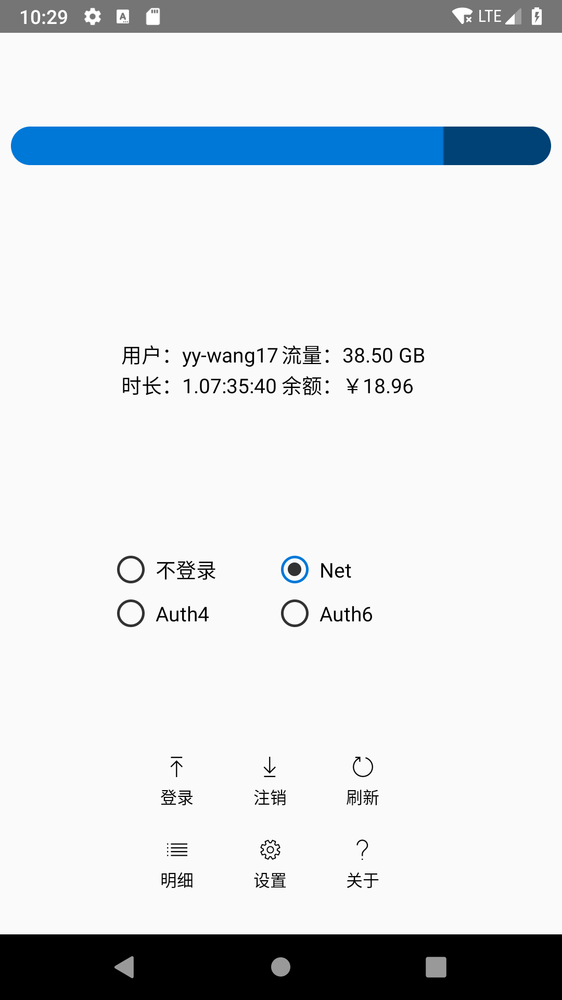
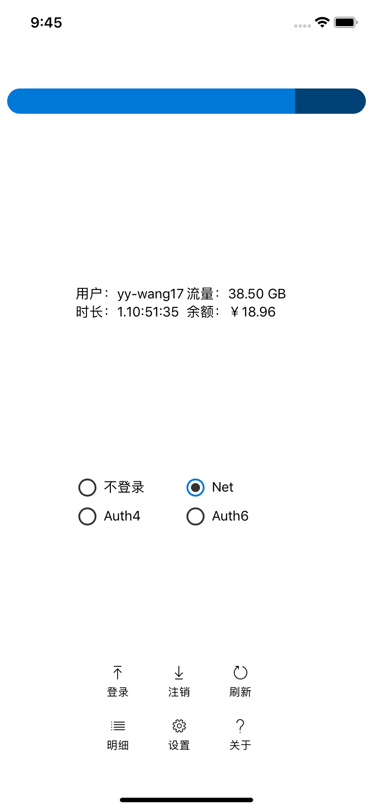
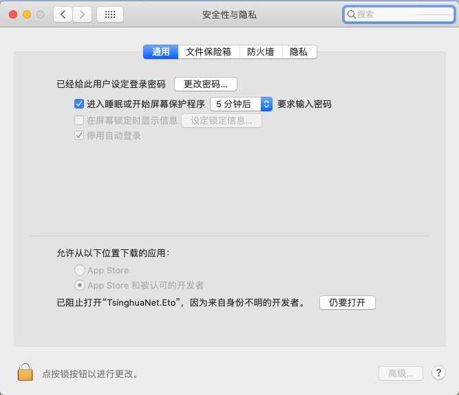

# TsinghuaNet
清华大学校园网联网库与客户端。

## TsinghuaNet
联网库，和一些其他项目需要的辅助类。支持 .NET Standard 2.0。

## TsinghuaNet.CLI
命令行版本，支持 .NET Core 3.0，并有针对Windows x64、Linux x64、Mac OS X x64的AOT版本。
### 登录/注销
**注意：** 登录与注销方式必须对应。
``` bash
# 使用默认（自动判断）方式登录
TsinghuaNet.CLI login
# 使用默认（自动判断）方式注销
TsinghuaNet.CLI logout
# 使用auth4方式登录
TsinghuaNet.CLI login -s auth4
# 使用auth4方式注销
TsinghuaNet.CLI logout -s auth4
```
### 在线状态
``` bash
# 使用默认（自动判断）方式
TsinghuaNet.CLI status
# 使用auth4方式
TsinghuaNet.CLI status -s auth4
```
### 查询/强制下线在线IP
``` bash
# 查询
TsinghuaNet.CLI online
# 强制下线
TsinghuaNet.CLI drop -a IP地址
```
### 流量明细
``` bash
# 使用默认排序（注销时间，升序）查询明细
TsinghuaNet.CLI detail
# 使用登录时间（升序）查询明细
TsinghuaNet.CLI detail -o login
# 使用流量降序查询明细
TsinghuaNet.CLI detail -o flux -d
# 使用流量降序查询明细，并按注销日期组合
TsinghuaNet.CLI detail -o flux -dg
```

## TsinghuaNet.Eto
Eto.Forms版本。支持Windows、Linux与Mac OS桌面平台，平台与实现方式如下表：

|平台|Windows|Linux|Mac OS|
|-|:-:|:-:|:-:|
|实现|WPF|GTK#|MonoMac|
|框架|.NET Core/.NET Framework|.NET Core|Mono|
|屏幕截图||||

## TsinghuaNet.Uno
Uno版本。支持UWP、Android与iOS平台。

|平台|UWP|Android|iOS|
|-|:-:|:-:|:-:|
|最低版本|10.0.16299(1709)|4.1(Jelly Bean)|10|
|屏幕截图||||

# Q&A
## 为什么需要一个客户端？
为了连接校园网，我们通常需要登录特定的网址，输入用户名和密码，并点击登录。这很麻烦，且由于各种技术原因容易出现误操作。而使用客户端，可以自动完成这些操作，节约时间。
## 这些客户端有什么优势？
* 速度快。
* 针对不同的网络类型给出建议。
* 查看本月流量明细。
* 第一个支持Tsinghua-IPv4与Tsinghua-IPv6无线网。
* 在网络状态改变时会自动判断，后台连接。（UWP）
* 后台刷新流量，更新磁贴。（UWP）
## 如何确保我的信息安全？
* 用户名和密码使用[Windows凭据管理器](https://support.microsoft.com/zh-cn/help/4026814/windows-accessing-credential-manager)（UWP）、[AndroidKeyStore](https://developer.android.com/reference/java/security/KeyStore)（Android）、[KeyChain](https://developer.apple.com/documentation/security/certificate_key_and_trust_services/keys/storing_keys_in_the_keychain)（iOS）管理。（Uno）
* 其他涉及隐私的信息，如在线用户、上网明细，即时从相应网站获得，不存储。
* 登录时使用了相应的加密算法。
* 所有代码开源，欢迎审核。
## 从哪里下载最新版的程序？
在[Releases](https://github.com/Berrysoft/TsinghuaNet/releases)页面。
## 我该如何从源代码编译这个程序？
为Visual Studio安装“.NET Core 桌面开发”，并需要 .NET Core SDK 3.0。

编译Uno版本还需要安装“通用 Windows 平台开发”与“使用.NET的移动开发”，并需要Windows SDK 10.0.18362。

为Mac编译Eto版本需要安装Mono。
## 我可以使用这里的源代码吗？
可以。这个项目使用[MIT许可证](./LICENSE)开源。
## 这个程序能卸载干净吗？
卸载时，除了凭据，所有个人配置都会被删除。凭据仅在选中“保存密码”时保存。（Uno）

CLI版本的用户名和密码保存在用户文件夹下的`.config/TsinghuaNet.CLI/settings.json`，仅在运行`savecred`后创建，可使用`deletecred`删除。

Eto版本的配置文件保存在用户文件夹下的`.config/TsinghuaNet.Eto/settings.json`。
## Eto.Forms版本在Mac上打不开，提示“来自身份不明的开发者”（Eto独有）
进入系统偏好设置，双击“安全性与隐私”，点击“仍要打开”，如下图：


## 后台任务会不会拖慢系统速度？（UWP）
不会。
## 这个程序的颜色在我的电脑上和你的电脑上不同！（UWP）
因为用的是主题色。
## 我对这个程序有一些问题/建议……
欢迎[Issues](https://github.com/Berrysoft/TsinghuaNet/issues)和[Pull requests](https://github.com/Berrysoft/TsinghuaNet/pulls)。
## 大佬太厉害了！
反弹！您才是大佬！
