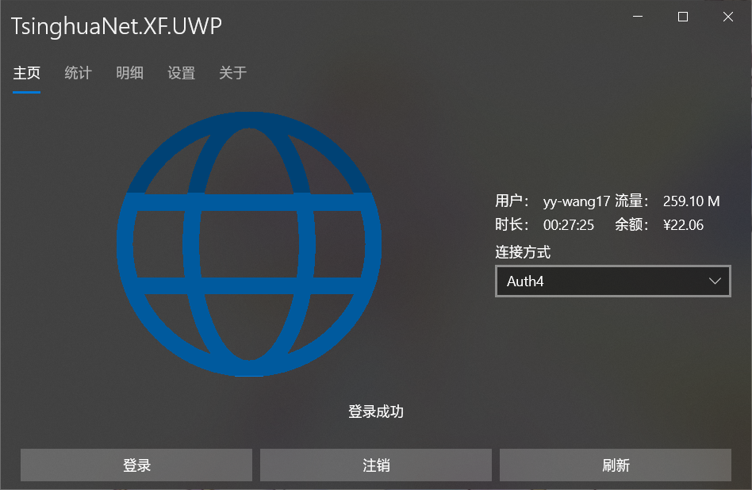

# TsinghuaNet
清华大学校园网联网库与客户端。

这个项目已经完成，进入维护阶段。
## 官方资源
* [Releases](https://github.com/Berrysoft/TsinghuaNet/releases)
* [Wiki](https://github.com/Berrysoft/TsinghuaNet/wiki)

## 项目介绍
### TsinghuaNet
联网库，和一些其他项目需要的辅助类。支持 .NET Standard 2.0、 .NET Standard 2.1和 .NET 5.0。

### TsinghuaNet.Native
提供了C/C++接口的Native库。

### TsinghuaNet.CLI
命令行版本，支持 .NET Core 5.0，并有针对Windows x64、Linux x64、Mac OS X x64的AOT版本。

### TsinghuaNet.Eto
Eto.Forms版本。支持Windows、Linux与Mac OS桌面平台。

|平台|Windows|Linux|Mac OS|
|-|:-:|:-:|:-:|
|实现|[WPF](https://github.com/dotnet/wpf)|[GTK#](https://github.com/GtkSharp/GtkSharp)|[MonoMac](https://github.com/cwensley/monomac)|
|框架|.NET Core/.NET Framework|.NET Core|.NET Core|
|屏幕截图||||

### TsinghuaNet.XF
Xamarin.Forms版本。支持UWP、Android与iOS平台。

|平台|UWP|Android|iOS|
|-|:-:|:-:|:-:|
|最低版本|10.0.16299(1709)|7.0(Nougat)|8.0|
|屏幕截图（竖）||||
|屏幕截图（横）||||
