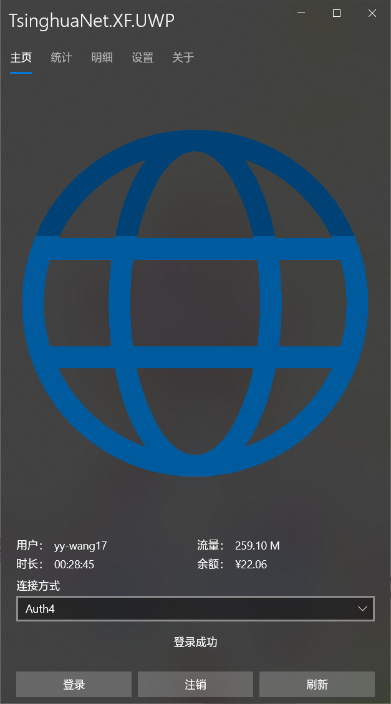
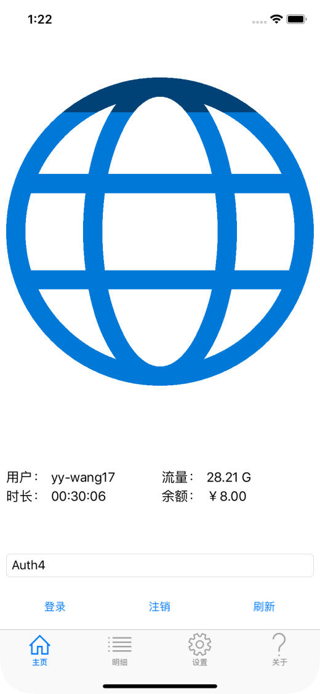

# 此项目已封存
将着重维护 Rust 版本，链接： https://github.com/Berrysoft/tunet-rust

# TsinghuaNet
清华大学校园网联网库与客户端。

这个项目已经完成，进入维护阶段。

## 官方资源
* [Releases](https://github.com/Berrysoft/TsinghuaNet/releases)
* [Wiki](https://github.com/Berrysoft/TsinghuaNet/wiki)

## 项目介绍
### TsinghuaNet
联网库，和一些其他项目需要的辅助类。支持 .NET Standard 2.0 和 .NET Standard 2.1。

### TsinghuaNet.XF
移动端版本。支持UWP、Android与iOS平台。

| 平台           |                UWP                 |                  Android                   |                iOS                 |
| -------------- | :--------------------------------: | :----------------------------------------: | :--------------------------------: |
| 最低版本       |          10.0.17763(1809)          |              6.0(Marshmallow)              |                8.0                 |
| 屏幕截图（竖） |  |  |  |
| 屏幕截图（横） |  |  |  |
